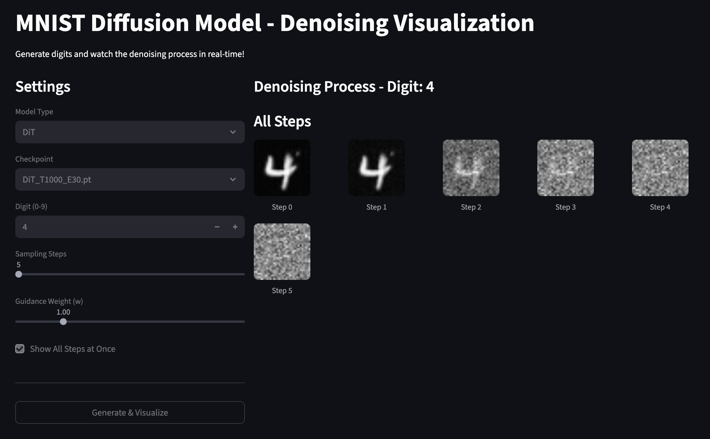
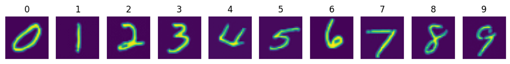
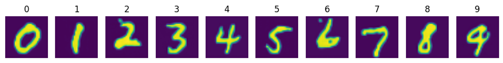
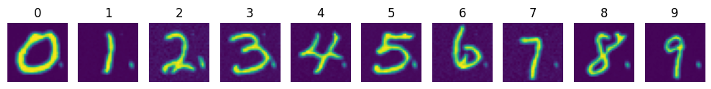
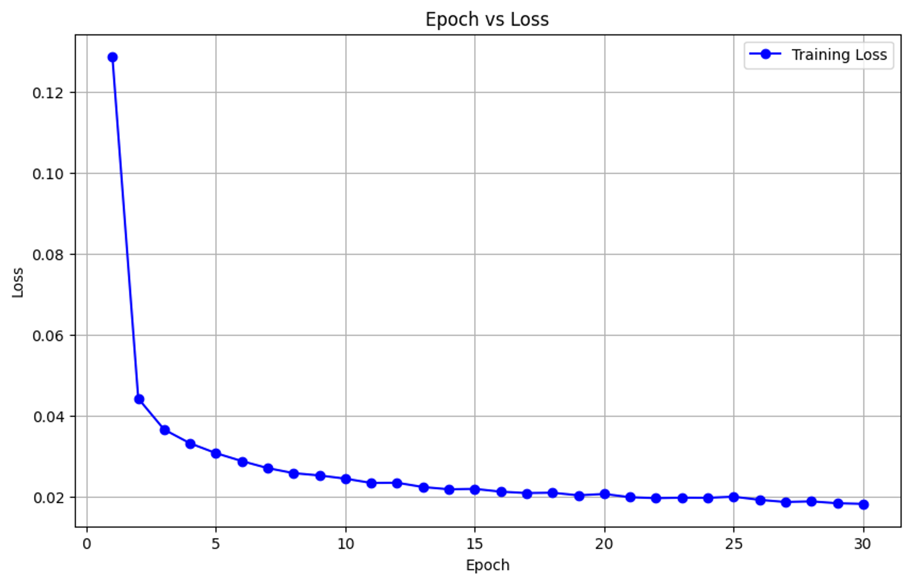

# Diffusion Model Toy Project (MNIST)

This is a toy project that trains a diffusion model using the MNIST dataset. It implements core diffusion model techniques such as DDPM, DDIM, and Classifier-Free Guidance.

Beyond a simple implementation, this project has been improved for scalability and maintainability, featuring configuration file-based management, support for various model architectures (UNet, DiT), code formatting, and unit testing.

## ✨ Features

- **Multiple Model Architectures**: Supports both traditional `UNet` and modern `Diffusion Transformer (DiT)` models, easily switchable via command-line arguments.
- **Config-Based Management**: Manages model parameters and training settings via `config.yaml`, allowing for various experiments without code changes.
- **Apple Silicon (MPS) Support**: Automatically detects and accelerates using the GPU (MPS) on Apple M-series chips.
- **Comprehensive Testing**: Unit tests via `pytest` ensure code correctness and facilitate refactoring.
- **Scripted Execution**: `scripts/train.sh` and `scripts/inference.sh` provide automated training and sampling workflows.

## 📁 Project Structure

```
tiny-DDPM/
├── config.yaml              # Model and training configuration
├── train.py                 # Main training script
├── sampling.py              # Image generation script
├── gui.py                   # GUI for visualizing denoising process
├── scripts/
│   ├── train.sh             # Training automation script
│   └── inference.sh         # Sampling automation script
├── src/tiny_DDPM/
│   ├── Diffusion.py         # Main diffusion orchestrator
│   ├── forward_encoder.py   # Noise addition (q(x_t|x_0))
│   ├── reverse_decoder.py   # DDPM/DDIM sampling algorithms
│   ├── noise_sheduler.py    # Beta/alpha schedule management
│   ├── Utils.py             # Utility functions
│   └── modules/
│       ├── UNet.py          # U-Net architecture
│       ├── DiT.py           # Diffusion Transformer
│       └── layer.py         # Shared building blocks
└── tests/                   # Unit tests
```

## ⚙️ Setup

1.  **Clone Repository**
    ```bash
    git clone https://github.com/your-username/tiny-DDPM.git
    cd tiny-DDPM
    ```

2.  **Install Dependencies**
    Install the required libraries using `uv` (recommended) or `pip`.
    ```bash
    # Using uv (recommended)
    uv sync

    # Or using pip
    pip install .
    ```

## 🚀 Training

Use the `train.py` script to train the model. You can select `UNet` or `DiT` via the `--model-type` argument. Detailed model structures are defined in `config.yaml`.

**Example Commands:**

- **Train UNet Model**
  ```bash
  python3 train.py --model-type UNet --epochs 30 --batch-size 8 --lr 0.0001
  ```

- **Train DiT Model**
  ```bash
  python3 train.py --model-type DiT --epochs 50 --batch-size 4 --lr 0.0002
  ```

### Using Shell Script

The `scripts/train.sh` file contains various training examples. The batch size is optimized for an 8GB RAM environment.

```bash
# Grant execution permission
chmod +x scripts/train.sh

# Run script (Train UNet and DiT sequentially)
./scripts/train.sh
```

Trained models (`*.pt`) and loss history (`history.pt`) are saved in the project root directory.

## 🧪 Testing

Run unit tests to verify code correctness:

```bash
pytest tests/
```

## 🎨 Sampling

To generate new images using a trained model, use `sampling.py`. You must specify the model type and weight file path via `--model-type` and `--model-path` arguments.

**Example Command:**

```bash
# Sample with trained UNet model
python3 sampling.py --model-type UNet --model-path "UNet_T1000_E30.pt"
```

### Using Shell Script

The `scripts/inference.sh` file provides an automated sampling workflow:

```bash
# Grant execution permission
chmod +x scripts/inference.sh

# Run script
./scripts/inference.sh
```

Generated images are saved in the `samples/` directory.

## 🎮 GUI Visualization

Run the web-based GUI to visualize the denoising process interactively:

```bash
# Install Streamlit
pip install streamlit

# Run the GUI
streamlit run src/gui.py
```

The web-based GUI allows you to:
- **Input a digit (0-9)** to generate
- **Select model type** (UNet or DiT)
- **Choose a checkpoint file** from your trained models
- **Adjust sampling parameters** (steps, guidance weight)
- **Visualize the denoising process** step by step with a slider

### Screenshot



## 📊 Result

- DDIM with `len(τ) = 10`
- `w` = 1 (CFG sampling ratio)





### Training Loss


## 📚 Reference Papers

- [Denoising Diffusion Probabilistic Model](https://arxiv.org/abs/2006.11239)
- [Denoising Diffusion Implicit Models](https://arxiv.org/abs/2010.02502)
- [Classifier-Free Diffusion Guidance](https://arxiv.org/abs/2207.12598)
- [Scalable Diffusion Models with Transformers (DiT)](https://arxiv.org/abs/2212.09748)
- [High-Resolution Image Synthesis with Latent Diffusion Models](https://arxiv.org/abs/2112.10752)